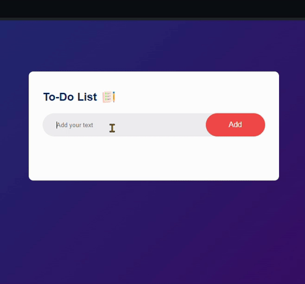

# To-Do List App 📝

## Overview
This simple To-Do List App allows you to manage your tasks efficiently. Keep track of your daily activities and stay organized with ease.

### Technologies Used 🚀
- HTML
- CSS
- JavaScript



## Features ✨

1. Add Tasks: Enter your tasks in the input box and click the "Add" button to add them to your to-do list.

2. Mark as Completed: Click on a task to mark it as completed. The app will visually indicate completed tasks.

3. Delete Tasks: Remove unwanted tasks by clicking the "x" icon next to each task.

4. Persistent Storage: Your to-do list is stored locally using the browser's localStorage. This means your tasks will persist even if you refresh the page or close the browser.

## Installation

- Clone the repository to your local machine:
    ```bash
    git clone https://github.com/NisaGokdemir/todo_app.git
- Open the project directory:
    ```bash
    cd todo-list-app
- Open the index.html file in your web browser.


## Live Demo 🌐
Live Demo : [To-Do Demo](https://todo-app-nisas-projects-d0a6f5b0.vercel.app/)

## Contributing 🎯
Feel free to use and customize the project! If you have any questions or feedback, you can reach me at nisagokdemir@gmail.com. Enjoy!